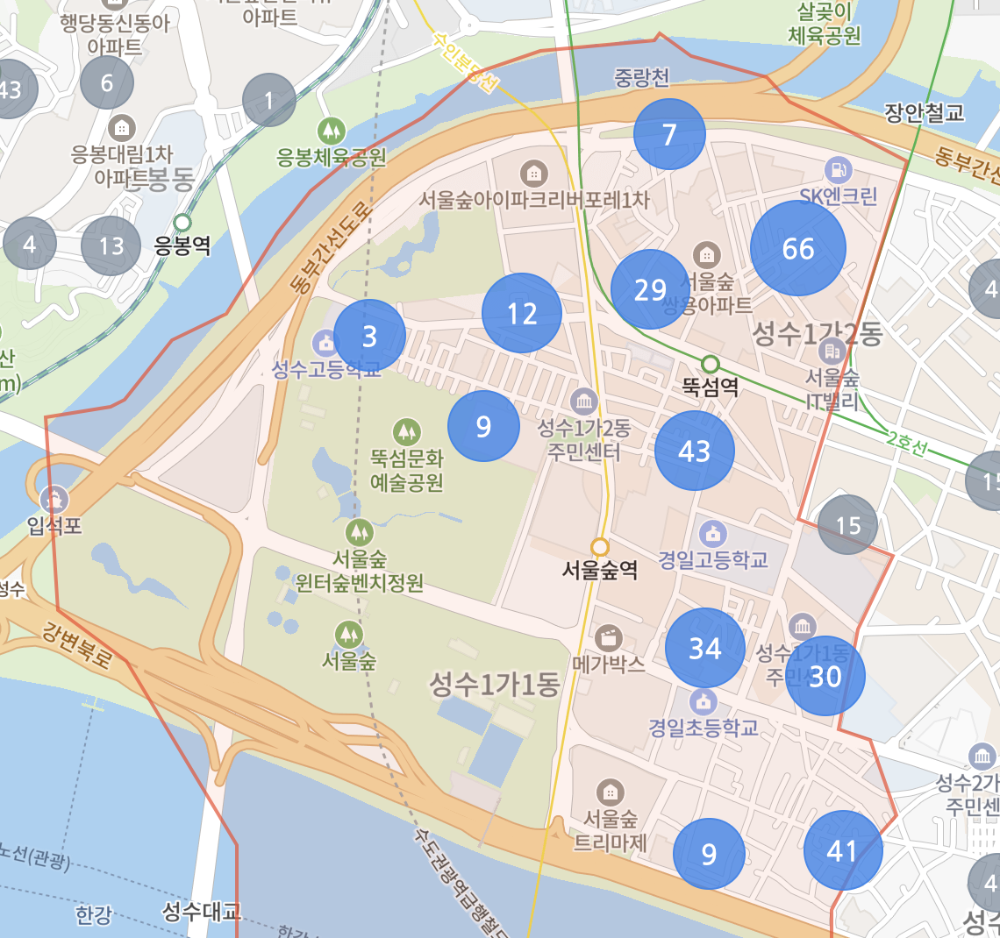

# ez-naver-real-estate
네이버 부동산의 데이터를 표 형태로 간편하게 보기 위해 만든 저장소입니다.
- 내가 원하는 필터를 복합적으로 거는게 불편해서 직접 만들었습니다.
- 조회되는 모든 내용은 네이버 부동산의 자산이며, 문제가 된다면 삭제하겠습니다.

<br />

# 초기 설정 (필수)
- 네이버 부동산을 조회하는 시점에 네트워크 탭의 헤더-요청헤더에서 본인의 cookie와 authorization을 추출한 뒤, `.env` 파일을 만들어서 아래 형태로 넣어주세요.
```
NAVER_COOKIE={내 네이버 쿠키 붙여넣기}
NAVER_AUTHORIZATION={내 AUTH 붙여넣기}
```

# 사용법
- 지역과 부동산 종류, 거래 종류를 선택하고 필터를 입력하세요. 지금은 한정된 필터만 존재합니다. 
- 지역: 네이버 부동산에서 매물이 나타나기 시작하는 하나의 지역 단위를 의미합니다. 예를 들어, `뚝섬역`은 아래 이미지로 표시된 지역입니다.
    
- 지역을 직접 추가하시려면 아래 이미지를 참고하여 지역이 선택되는 시점에 네트워크 탭에서 `cortarNo`를 추출한 뒤, `sidebar/page_get_data.py`의 30line `cortar_map`에 추가하시면 됩니다.
    
- 건의사항/개선 의견이 있다면 ud803da@gmail.com 으로 보내주세요.